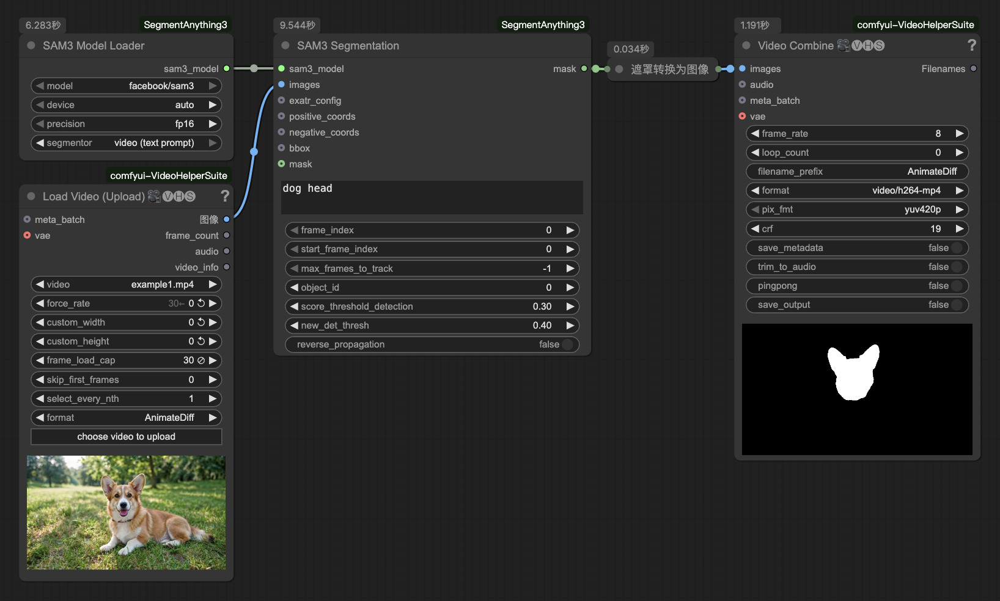

# ComfyUI-SegmentAnything3  
Run the Segment Anything Model 3 in a easy way in ComfyUI  
**[[📃中文版](./README_zh.md)]**  

## Preview  


## Installation  

#### Install the node:  
```bash
cd ComfyUI/custom_nodes
git clone https://github.com/lihaoyun6/ComfyUI-SegmentAnything3.git
python -m pip install -r ComfyUI-SegmentAnything3/requirements.txt
``` 

#### Download models:  
- The required model will be automatically downloaded to `ComfyUI/models/sams/[model_id]` folder.  

## Notes
Please ensure that your `transformers` version >= `5.0.0dev` after installing the dependencies.  
Otherwise, you may need to uninstall `transformers` and reinstall the dependencies.

## Credits  
- [SAM3](https://github.com/facebookresearch/sam3) @facebook
- [ComfyUI](https://github.com/comfyanonymous/ComfyUI) @comfyanonymous
